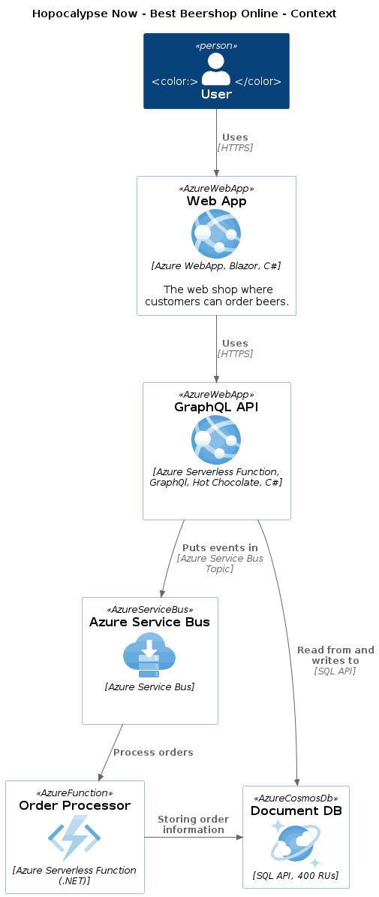

| | |
|-|-|
|  |  |

# Hopocalypse Now: Brews for the End Times!

## Scenarios

Mongo vs CosmosDb

Sql Server vs CosmosDb
Sql Server vs Azure Sql Server (serverless)
Sql Server vs PostgreSql (serverless)

Worker vs Function

Rabbitmq vs Azure Service Bus

Elastic Search + logstash + Kibana vs App Insights

## Notes

