| Infra | Source |
|-|-|
|  |  |
|  |  |
|  |  |
|  |  |
|  | |

# Hopocalypse Now: Brews for the End Times

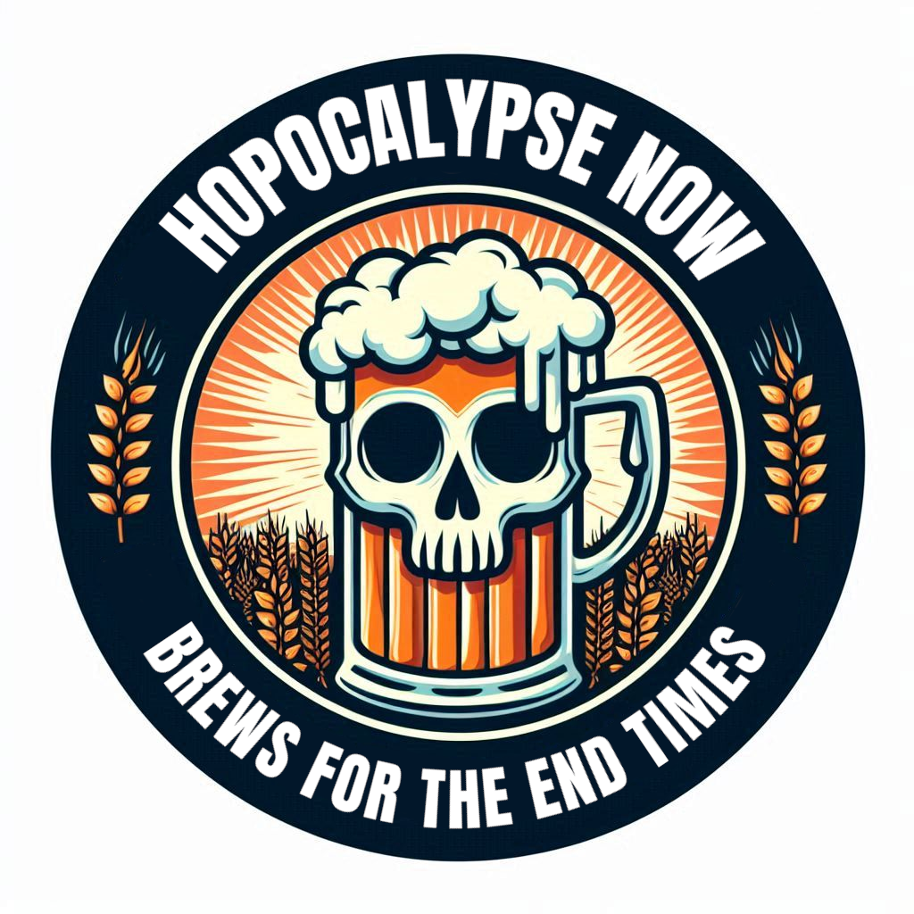 This repository is used for a presentation to explain the basics of Team Topologies by using an online beer web shop as an example. It will start with a platform team, creating all services needed for value-stream teams to deploy services.

This documentation describes the flow and how to deploy the various parts. there are a few requirements to be able to deploy this application yourself.

 

## Prerequisites

* Access to Azure
* Azure CLI + Bicep

## The Application Context

The context diagram of this application looks like this:

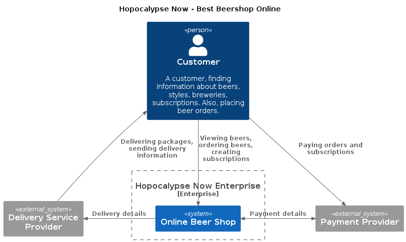

## The Platform Team

The Platform Team is one of the first teams that starts. They want to provide a platform where Stream-Aligned Teams (and other teams) can easily onboard, making use of all the services they provide. the Platform Team is the hub in the so-called 'Hub and Spoke Model'. The first service they are going to provision is a GraphQL Api, which other teams can use to get products, add orders,

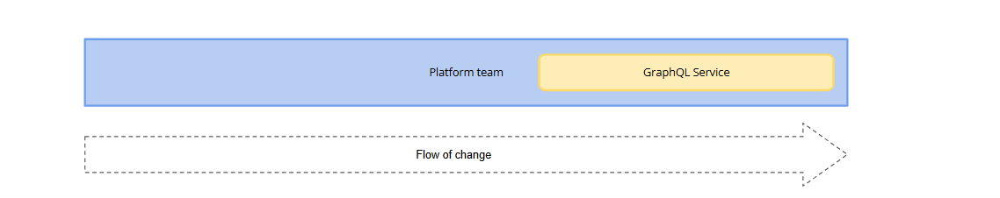

### Deploy the hub

1. Run landingzone action (duration: 6:08)
2. Run Landingzone - Deploy FrontendApi FunctionApp (duration: )

### 

## Products Team (Stream-Aligned Team)

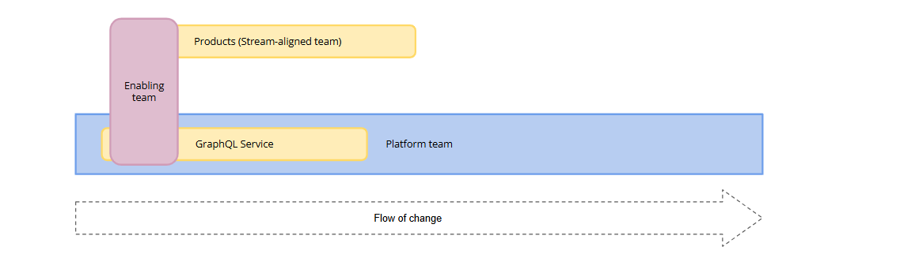

## Marketing Team (Stream-Aligned Team)

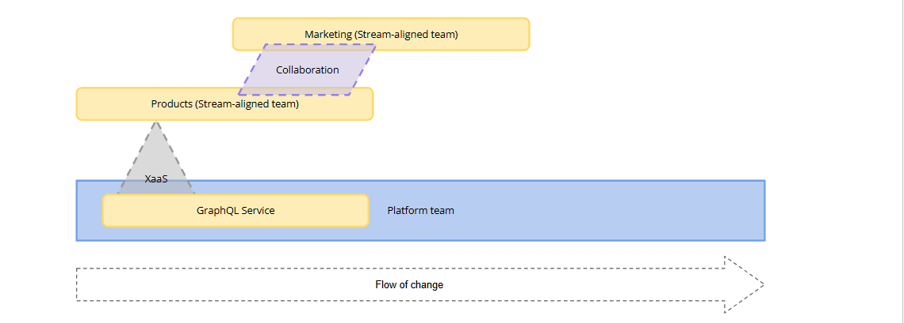

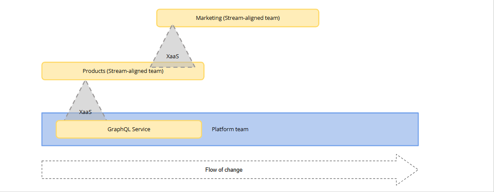

## Orders Team (Stream-Aligned Team)

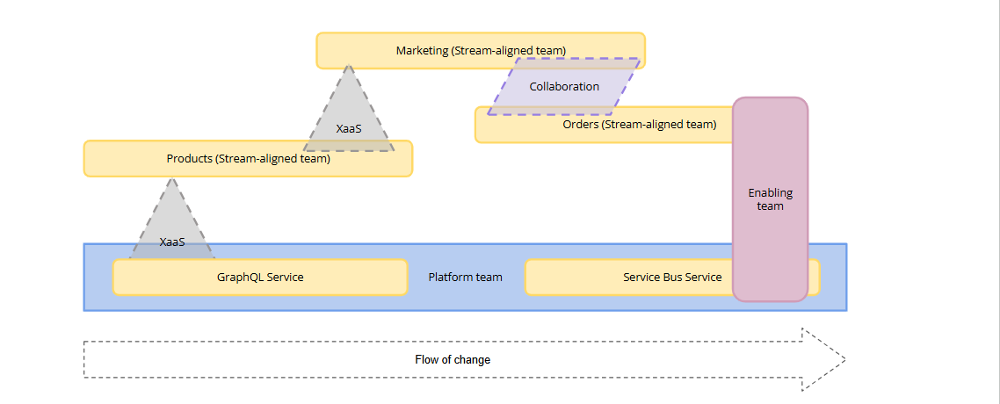

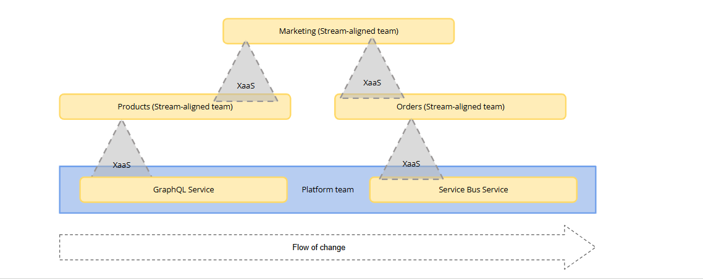

## Payments Team (Stream-Aligned Team)

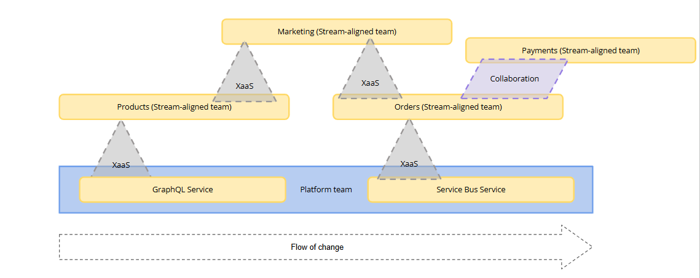

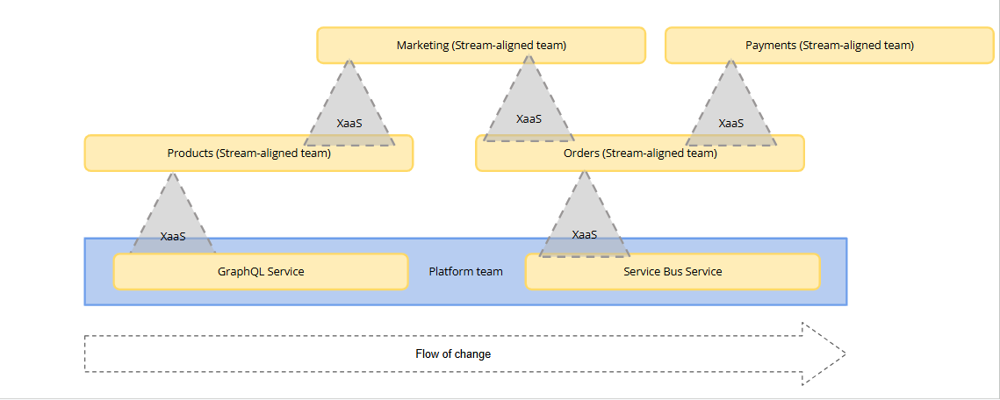

## Tasted-based Predictions Team (Complicated Subsystem Team)

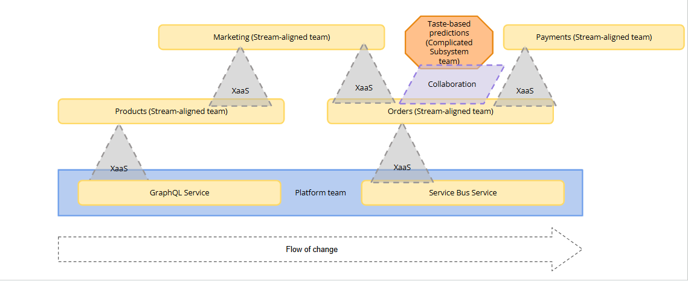

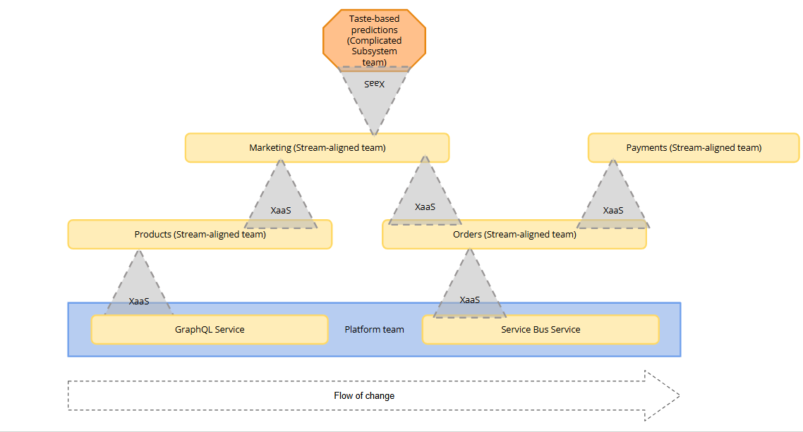

## The current situation

Except the Complicated Subsystems team implementation. Too complex for this example.

## Resources

* [Team Topologies Website](https://teamtopologies.com/)
* [Team Topologies Shapes](https://github.com/TeamTopologies/Team-Shape-Templates)
* [C4 model website](https://c4model.com/)
* [C4 model + PlantUML](https://github.com/plantuml-stdlib/C4-PlantUML)
* [PlantUML + Azure](https://github.com/plantuml-stdlib/Azure-PlantUML)
* [Hub & Spoke Topology](https://www.cbtnuggets.com/blog/technology/networking/what-is-hub-and-spoke-topology)